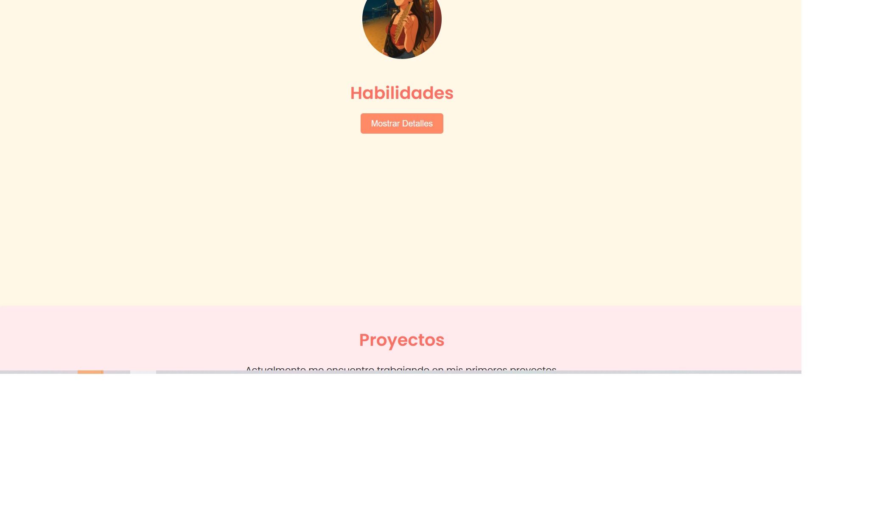

# Práctica Formativa Obligatoria 2 - Landing Page de Portafolio Personal

## Autor

Elizabeth Geno 🕵️‍♀️

## [URL GitHub Pages]

## 1. Validación de Formulario

**Descripción:** Se añadió una validación básica a los campos del formulario de contacto para asegurar de que el usuario ingrese la información en el formato correcto (nombre, apellido, email, teléfono).
Para el campo de email, se implementó una validación con una expresión regular para verificar que el email ingresado tenga el formato adecuado.

**Justificación:** Es importante que los formularios de contacto validen los datos para garantizar que la información ingresada sea correcta y útil para la interacción con el usuario.

## 2. Modo Oscuro

**Descripción:** Se implementó un modo oscuro que permite al usuario alternar entre un diseño de interfaz claro y oscuro a través de un interruptor. Este modo afecta los colores de fondo, texto y otros elementos clave de la interfaz para mejorar la legibilidad en condiciones de poca luz.

**Implementación:**

- Se utilizó un checkbox (`<input type="checkbox">`) como interruptor para activar y desactivar el modo oscuro.
- Al cambiar el estado del checkbox, se añadieron y eliminaron clases CSS (`modo-oscuro`) tanto al cuerpo de la página (`body`) como a los elementos relevantes (como el encabezado, los formularios y los botones).

**Justificación:** El modo oscuro es una funcionalidad útil en el diseño web, especialmente para usuarios que pasan mucho tiempo frente a la pantalla. Ofrecer la opción de cambiar entre modo claro y oscuro mejora la accesibilidad y permite a los usuarios personalizar su experiencia visual según sus preferencias. Al agregar esta opción, no solo se mejora la estética, sino que también se ofrece una alternativa que reduce la fatiga ocular en ambientes con poca luz.

## 3. Pop-up de Confirmación de Envío

**Descripción:** Se implementó una ventana emergente (pop-up) que se muestra automáticamente cuando el usuario completa correctamente el formulario y lo envía. Esta ventana contiene un mensaje de confirmación junto a un botón para cerrarla, lo que permite al usuario saber que el formulario fue enviado exitosamente.

**Justificación:** Se eligió esta funcionalidad para mejorar la experiencia del usuario, brindando una respuesta visual clara e inmediata luego del envío del formulario. Un mensaje pop-up es más notorio que un simple `alert()`, ya que se puede personalizar visualmente (colores, tamaño, ubicación, etc.), integrándose con el diseño del sitio.

## 4. Ocultar y/o Mostrar Contenido (Sección Proyectos)

**Descripción:** Se implementó un botón en la sección de "Proyectos" que permite mostrar u ocultar un mensaje placeholder que indica que los proyectos estarán disponibles próximamente. El botón cambia su texto dinámicamente según el estado del contenido, alternando entre "Mostrar Detalles" y "Ocultar Detalles". Esta funcionalidad fue desarrollada mediante JavaScript utilizando `addEventListener` y manipulando directamente el estilo de visibilidad del contenido.

**Justificación:** Esta funcionalidad permite mejorar la experiencia del usuario al brindarle control sobre lo que desea ver, manteniendo la interfaz limpia y sin exceso de información estática. Además, demuestra el uso práctico de eventos y manipulación del DOM, lo que resulta útil para el desarrollo de interfaces más dinámicas e interactivas.

## 5. Creación de Contenido Dinámico (Sección Películas Favoritas)

**Descripción:** Se genera dinámicamente el contenido de la sección "Películas Favoritas" utilizando JavaScript. En lugar de escribir las tarjetas de películas directamente en HTML, se crea un array de objetos con los datos (título, imagen y descripción), y luego se recorre ese array para construir e insertar cada tarjeta en el DOM de forma automática.

**Justificación:** Esta funcionalidad demuestra el uso de arrays, bucles y manipulación del DOM con JavaScript, elementos clave del desarrollo frontend. Permite mantener el código más limpio, modular y fácil de actualizar: para agregar una nueva película, solo se necesita añadir un nuevo objeto al array, sin modificar el HTML. Además, este enfoque facilita la escalabilidad y reutilización del código, habilidades fundamentales en cualquier proyecto profesional.

## 🔧 Mejoras estructurales y de estilos realizadas:

**1. Manejo de visibilidad mediante clases**

En vez de aplicar `display: none/block` directamente desde JavaScript (lo cual interfería con el `display: flex` de las tarjetas), se manipuló la visibilidad a través de una clase `.visible`. Esta clase permite que el CSS administre correctamente la distribución en pantalla sin romper el diseño.

**2. Transición de altura y padding al mostrar/ocultar**

Se usó CSS para colapsar visualmente el contenedor (`height: 0` y `padding: 0`) cuando está oculto, y se restauraron sus valores originales con una transición suave al mostrarse. Esto evita que quede un espacio vacío en la página cuando el contenido está oculto.

## Justificación de los cambios y beneficios:

**1. Separación de responsabilidades (clean code):**

Controlar la visibilidad mediante clases mantiene el código limpio y ordenado: HTML estructura, CSS da estilo, y JavaScript define comportamiento. Esto mejora el mantenimiento del proyecto y evita conflictos entre estilos.

**2. Mejora estética y experiencia de usuario:**

Al evitar que el contenedor deje un espacio visible al ocultarse, y al mostrarlo con una transición animada, la interacción se vuelve más fluida y agradable. El sitio se percibe más profesional y dinámico.

## CAPTURAS 
###  Captura de la versión anterior

## Captura con las mejoras aplicadas

